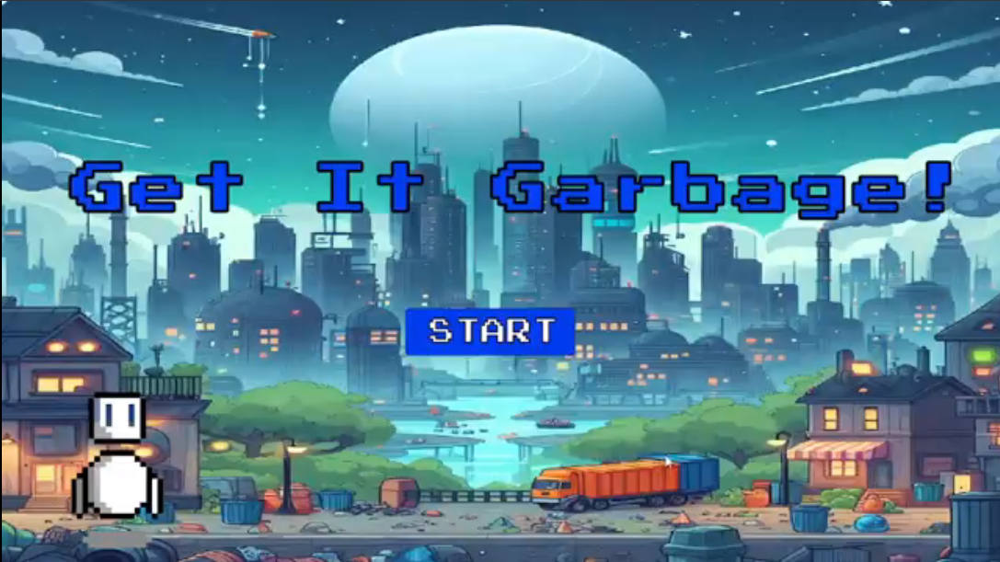

# Projeto Jogo 2D: Get it Garbage

 > ℹ️ **NOTE:** Este documento descreve o processo de desenvolvimento do jogo "Get it Garbage", desde a concepção da ideia até a implementação final, detalhando aspectos de design, ferramentas utilizadas e desafios enfrentados.

Projeto com o objetivo de criar um jogo 2D de plataforma (em Unity), onde o jogador assume o controle da robô Garby, inspirada na personagem Eva do filme Wall-E. A missão é coletar lixo em um mundo devastado pela poluição e avanços tecnológicos descontrolados, enfrentando desafios para restaurar o ambiente. O gameplay foi projetado para ser simples e intuitivo, visando um público amplo.

## 💻 Tecnologias utilizadas no projeto

- Engine: Unity, uma das engines mais populares e com vasto suporte a diferentes plataformas.
- Linguagem de Programação: C#, escolhida por sua compatibilidade com a Unity e facilidade no uso para manipulação de objetos e eventos.
- Design Gráfico (Sprites): Piskelapp, utilizado para a criação do sprite da personagem Garby (inspirada no Google) e alguns objetos coletáveis e obstáculos, garantindo consistência visual.
- Design Gráfico (Backgrounds): Copilot Design, utilizado para desenvolver as imagens de background que retratam o mundo devastado, criando uma atmosfera sombria e imersiva.
- Design Gráfico (Tilesets): Pack "Pixel Adventure 1" adquirido na loja da Unity, escolhido pela qualidade e compatibilidade com o estilo visual.
- Áudio/Trilha Sonora (OST): Suno, utilizado para selecionar músicas com estilo 16-bit, downtempo, slow e ethereal para complementar a atmosfera do jogo.

## ✨ Como foi feito ?

O processo de desenvolvimento envolveu a concepção da ideia, design de arte e áudio, e implementação de mecânicas:

1. Concepção da Ideia: A inspiração surgiu após uma aula sobre criação de personagens pixelados no Piskelapp, onde o personagem criado lembrava a Eva do filme Wall-E. O grupo decidiu focar na coleta de lixo em um cenário de devastação ambiental.
2. Desenvolvimento Visual e Sonoro: O design gráfico buscou um ambiente impactante. Os backgrounds foram trocados e ajustados via Copilot Design para refletir os estágios de devastação. A trilha sonora foi selecionada no Suno para ser envolvente e complementar o jogo.
3. Implementação das Mecânicas: O jogo foi desenvolvido em Unity usando C#. Scripts foram criados para controlar o jogador (movimento e pulo duplo limitado), gerenciar a coleta de itens e introduzir obstáculos (plataformas que caem, serras).
4. Resolução de Problemas: Desafios cruciais incluíram a correção de um erro de código na coleta de itens, o ajuste da lógica para limitar o pulo duplo infinito, e a correção da detecção de colisão dos espinhos. Foi crucial implementar a lógica que exige que o jogador colete 10 lixos para avançar para o próximo nível.

## 🛠️ Instruções de execução

O jogador controla Garby, que pode se mover, pular sobre plataformas e evitar obstáculos. A progressão dos níveis é gradual, desafiando as habilidades do jogador.

🤖 1. Objetivo Principal: Coletar lixo espalhado pelos níveis. O jogador deve acumular 10 lixos para passar de fase. 
🤖 2. Progressão de Níveis: Os níveis introduzem gradualmente novas mecânicas e obstáculos:   
Nível 1 (Tutorial): Coleta de caixas de suco, familiarizando o jogador com os controles. 
Nível 2: Introdução dos primeiros obstáculos (espinhos) enquanto coleta latinhas.    
Nível 3: Adição de plataformas que se desmancham/caem, exigindo mais precisão nos pulos.   
Nível 4: Um nivel mais dificil para testar as habilidades desviando dos espinhos.
Nível 5: Introdução de serras móveis (que se movem da direita para a esquerda). 
Nível 6: O nível mais dificil do jogo sendo o ultimo, com a junção das serras móveis e espinhos menores para maior dificuldade. 
🤖 3. Fim de Jogo: A tela de Fim de Jogo é exibida se o personagem colidir com espinhos ou serras. Após completar todos os níveis, o jogador é recompensado com uma tela de conclusão.

## 👨‍💻 Expert

    
&nbsp&nbsp&nbspJuliana Benedetti 
    &nbsp&nbsp&nbsp
    <a 
        href="https://github.com/JujuBene">
        GitHub
    </a>
    &nbsp;|&nbsp;
    <a 
        href="https://www.linkedin.com/in/juliana-magiero-benedetti/">
        LinkedIn
    </a>
 
   
   

